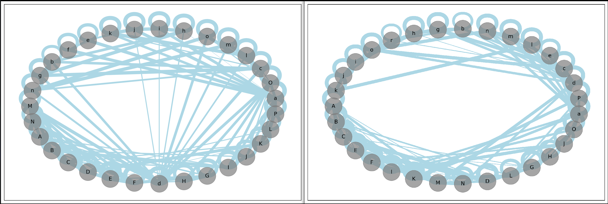
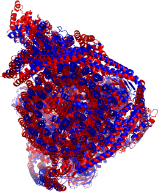

# Protein structure analysis workflow


## Installation

The following commands install dependencies of the workflow in the _current_
directory within the `.pixi` folder. After installation, you cannot move the
folder without re-installling all the dependencies.

```bash
curl -fsSL https://pixi.sh/install.sh | bash
# ... cd <this repo>
pixi install
```

Because of the dependency on apptainer, this workflow only works on linux.

## Usage

Run `pixi run help` for the help page. Targets can be made using `pixi run make <target>`

## Example

In this example, we will compare the structures of yeast V-ATPase state 2 ([6O7W](https://www.rcsb.org/structure/6O7W)) to that of Citrus ([7UWB](https://www.rcsb.org/structure/7UWB))


In the terminal type

```bash
# takes 20 mins to complete.
pixi run make results/contact-map/6o7v results/contact-map/7uwb results/comparison/7uwb-6o7w.tmscore.txt results/plip/6o7v results/plip/7uwb results/comparison/7uwb-6o7w.usalign.txt results/comparison/7uwb-6o7w.usalign.sup.png  results/comparison/7uwb-6o7w.usalign.sup.pse  --cores 5

```

To start the analysis with 5 paralel processes. This will download the structures and the programmes, and
run the analysis.

|  |
|---------------------------------------------|
| Subunit interaction graph between `6o7v` (left) and `7uwb` (right) |

```
 ********************************************************************
 * US-align (Version 20231222)                                      *
 * Universal Structure Alignment of Proteins and Nucleic Acids      *
 * Reference: C Zhang, M Shine, AM Pyle, Y Zhang. (2022) Nat Methods*
 * Please email comments and suggestions to zhang@zhanggroup.org    *
 ********************************************************************

Name of Structure_1: results/input/7uwb.pdb:1,A:1,B:1,C:1,D:1,E:1,F:1,G:1,H:1,I:1,J:1,K:1,L:1,M:1,N:1,O:1,P:1,a:1,b:1,c:1,d:1,e:1,g:1,h:1,i:1,j:1,k:1,l:1,m:1,n:1,r:1,o: (to be superimposed onto Structure_2)
Name of Structure_2: results/input/6o7w.pdb:1,C:1,D:1,E:1,F:1,A:1,B:1,G:1,H:1,I:1,J:1,K:1,L:1,M:1,N:1,O:1,P:1,a:1,b:1,c:1,d:1,e:1,g:1,h:1,i:1,k:1,l:1,m:1,n:1,o:1,j::1,f
Length of Structure_1: 7683 residues
Length of Structure_2: 8038 residues

Aligned length= 7339, RMSD=   5.26, Seq_ID=n_identical/n_aligned= 0.495
TM-score= 0.91077 (normalized by length of Structure_1: L=7683, d0=22.65)
TM-score= 0.87174 (normalized by length of Structure_2: L=8038, d0=23.02)
(You should use TM-score normalized by length of the reference structure)

(":" denotes residue pairs of d < 5.0 Angstrom, "." denotes other aligned residues)
YGYVRKVSGPVVIADGMNGAAMYELVRVGHDNLIGEIIRLEGDSATIQVYEETAGLMVNDPVLRTHKPLSVELGPGILGNIFDGIQRPLKTIAIRSGDVYIPRGVSVPALDKDTLWEFQPKKIGEGDLLTGGDLYATVFENSLM-QHHVALPPDAMGKVTYVAPAGQYSLKDTVLELEFQGVKKSFTMLQAWPVRTPRPVSSKLAADTPLLTGQRVLDALFPSVLGGTCAIPGAFGCGKTVISQALSKYSNSDTVVYVGCGERGNEMAEVLMDFPQLTMTLPDGREESVMKRTTLVANTSNMPVAAREASIYTGITIAEYFRDMGYNVSMMADSTSRWAEALREISGRLAEMPADSGYPAYLAARLASFYERAGKVKCLGGPERTGSVTIVGAVSPPGGDFSDPVTSATLSIVQVFWGLDKKLAQRKHFPSVNWLISYSKYSTALESFYEQFDPDFINIRTKAREVLQREDDLNEIVQLVGKDALAEGDKITLETAKLLREDYLAQNAFTPYDKFCPFYKSVWMMRNIIHFYNLANQAV---ITYTLIKHRLGDLFYRLVSQKFEDPAEGEPALVAKFKKLHEDLTAGFRALE-*LEVAMEYRTVTGVAGPLVILDKVKGPKYYEIVNIRLGDGTMRRGQVLEVDGEKAVVQVFEGTSGIDNKFTTVQFTGEVLKTPVSLDMLGRIFNGSGKPIDNGPPILPEAYLDISGSSINPSERTYPEEMIQTGISTIDVMNSIARGQKIPLFSAAGLPHNEIAAQICRQAG--L-VKRLEK---DNFAIVFAAMGVNMETAQFFKRDFEENGSMERVTLFLNLANDPTIERIITPRIALTTAEYLAYECGKHVLVILTDMSSYADALREVSAAREEVPGRRGYPGYMYTDLAQIYERAGRIEGRKGSITQIPILTMPNDDITHPTPDLTGYITEGQIYIDRQLQNRQIYPPINVLPSLSRLMKSAIGEGMTRRDHSDVSNQLYANYAIGKDVQAMKAVVGEEALSSEDLLYLEFLDKFERKFVAQGAYDSRNIFQSLDLAWTLLRIFPRELLHRIPGKTLDQYYSR*YGYVRKVSGPVVIADGMNGAAMYELVRVGHDNLIGEIIRLEGDSATIQVYEETAGLMVNDPVLRTHKPLSVELGPGILGNIFDGIQRPLKTIAIRSGDVYIPRGVSVPALDKDTLWEFQPKKIGEGDLLTGGDLYATVFENSL-MQHHVALPPDAMGKVTYVAPAGQYSLKDTVLELEFQGVKKSFTMLQAWPVRTPRPVSSKLAADTPLLTGQRVLDALFPSVLGGTCAIPGAFGCGKTVISQALSKYSNSDTVVYVGCGERGNEMAEVLMDFPQLTMTLPDGREESVMKRTTLVANTSNMPVAAREASIYTGITIAEYFRDMGYNVSMMADSTSRWAEALREISGRLAEMPADSGYPAYLAARLASFYERAGKVKCLGGPERTGSVTIVGAVSPPGGDFSDPVTSATLSIVQVFWGLDKKLAQRKHFPSVNWLISYSKYSTALESFYEQFDPDFINIRTKAREVLQREDDLNEIVQLVGKDALAEGDKITLETAKLLREDYLAQNAFTPYDKFCPFYKSVWMMRNIIHFYNLANQAVEKGAGMDGQKITYTLIKHRLGDLFYRLVSQKFEDPAEGEPALVAKFKKLHEDLTAGFRALEDETR*EGTLEVAMEYRTVTGVAGPLVILDKVKGPKYYEIVNIRLGDGTMRRGQVLEVDGEKAVVQVFEGTSGIDNKFTTVQFTGEVLKTPVSLDMLGRIFNGSGKPIDNGPPILPEAYLDISGSSINPSERTYPEEMIQTGISTIDVMNSIARGQKIPLFSAAGLPHNEIAAQICRQA--GLVKRLEKDGEEDNFAIVFAAMGVNMETAQFFKRDFEENGSMERVTLFLNLANDPTIERIITPRIALTTAEYLAYECGKHVLVILTDMSSYADALREVSAAREEVPGRRGYPGYMYTDLAQIYERAGRIEGRKGSITQIPILTMPNDDITHPTPDLTGYITEGQIYIDRQLQNRQIYPPINVLPSLSRLMKSAIGEGMTRRDHSDVSNQLYANYAIGKDVQAMKAVVGEEALSSEDLLYLEFLDKFERKFVAQGAYDSRNIFQSLDLAWTLLRIFPRELLHRIPGKTLDQYYSR*YGYVRKVSGPVVIADGMNGAAMYELVRVGHDNLIGEIIRLEGDSATIQVYEETAGLMVNDPVLRTHKPLSVELGPGILGNIFDGIQRPLKTIAIRSGDVYIPRGVSVPALDKDTLWEFQPKKIGEGDLLTGGDLYATVFENSLMQH-HVALPPDAMGKVTYVAPAGQYSLKDTVLELEFQGVKKSFTMLQAWPVRTPRPVSSKLAADTPLLTGQRVLDALFPSVLGGTCAIPGAFGCGKTVISQALSKYSNSDTVVYVGCGERGNEMAEVLMDFPQLTMTLPDGREESVMKRTTLVANTSNMPVAAREASIYTGITIAEYFRDMGYNVSMMADSTSRWAEALREISGRLAEMPADSGYPAYLAARLASFYERAGKVKCLGGPERTGSVTIVGAVSPPGGDFSDPVTSATLSIVQVFWGLDKKLAQRKHFPSVNWLISYSKYSTALESFYEQFDPDFINIRTKAREVLQREDDLNEIVQLVGKDALAEGDKITLETAKLLREDYLAQNAFTPYDKFCPFYKSVWMMRNIIHFYNLANQAVEKGAGMDGQKITYTLIKHRLGDLFYRLVSQKFEDPAEGEPALVAKFKKLHEDLTAGFRALEDETR*EGTLEVAMEYRTVTGVAGPLVILDKVKGPKYYEIVNIRLGDGTMRRGQVLEVDGEKAVVQVFEGTSGIDNKFTTVQFTGEVLKTPVSLDMLGRIFNGSGKPIDNGPPILPEAYLDISGSSINPSERTYPEEMIQTGISTIDVMNSIARGQKIPLFSAAGLPHNEIAAQICRQA--GL--V-KRG-EEDNFAIVFAAMGVNMETAQFFKRDFEENGSMERVTLFLNLANDPTIERIITPRIALTTAEYLAYECGKHVLVILTDMSSYADALREVSAAREEVPGRRGYPGYMYTDLAQIYERAGRIEGRKGSITQIPILTMPNDDITHPTPDLTGYITEGQIYIDRQLQNRQIYPPINVLPSLSRLMKSAIGEGMTRRDHSDVSNQLYANYAIGKDVQAMKAVVGEEALSSEDLLYLEFLDKFERKFVAQGAYDSRNIFQSLDLAWTLLRIFPRELLHRIPGKTLDQYYSR*----------Q-MVRFIRQEAEEKANEISVSAEEEFNIEKLQLVEAEKKKIRQEYERKEKQVEIRKKIEYSMQLNASRIKVLQAQDDLVSNMMEAASKEVLNVSRDHNSYKKLLKGLIVQSLLRLKEPAVLLRCRKDDHHLVESVLESAKEEYAQKLQ-VHPPEIIV-HHNAHGPSCSGGVVVASRDGKIVCENTLDARLDVVFRKKLPEIRKQLVS*---------LAAEQEAQHIVAAARNAKMARLRQAKEEAEREIAEHRAQVEREFQRKLAESSGDSGANVKRLEQETEVKIHHLNAGAEKIQYDVVQMLLKHVTTVKN*-----------MV-RFIRQEAEEKANEISVSAEEEFNIEKLQLVEAEKKKIRQEYERKEKQVEIRKKIEYSMQLNASRIKVLQAQDDLVSNMMEAASKEVLNVSRDHNSYKKLLKGLIVQSLLRLKEPAVLLRCRKDDHHLVESVLESAKEEYAQKLQVHPPEILPPGPGHHNAHGPSCSGGVVVASRDGKIVCENTLDARLDVVFRKKLPEIRKQLVS*-----L-AAEQEAQHIVAAARNAKMARLRQAKEEAEREIAEHRAQVEREFQRKLAESSGDSGANVKRLEQETEVKIHHLNAGAEKIQYDVVQMLLKH-VT-TVK-*-NDADVSKQIQQMVRFIRQEAEEKANEISVSAEEEFNIEKLQLVEAEKKKIRQEYERKEKQVEIRKKIEYSMQLNASRIKVLQAQDDLVSNMMEAASKEVLNVSRDHNSYKKLLKGLIVQSLLRLKEPAVLLRCRKDDHHLVESVLESAKEEYAQKLQVHPPEIIVDPGHHNAHGPSCSGGVVVASRDGKIVCENTLDARLDVVFRKKLPEIRKQLVS*----GIQQLLAAEQEAQHIVAAARNAKMARLRQAKEEAEREIAEHRAQVEREFQRKLAESSGDSGANVKRLEQETEVKIHHLNAGAEKIQYDVVQMLLKHVTTVK*VVPTVTMLGVMKSRLVGATRGHALLKKKSDALTVQFRQILKNIVTTKESMGEVMKDSSFALIEAKYVAGENIKHIVLENVQNASIKVRSRQENIAGVKIPKFEYFTDGETKNDLTG-----LARGGQQVQQCRAAYVKAIELLVELASLQTSFLTLDEAIKTTNRRVNALENVVKPRLENTITYIKGELDELEREDFFRLKKIQGYKKREIERQLASS*---SALIAMIADEDTVTGFLLAGVGNVDL-RRKTNYLIVDS-KTTVKAIEDAFKEFT-TKEDIAIVLISQYVANMIRFLVDSYNKPIPAILEIPSKDHPYDPAHDSVLSRVKN--*--ASR----YWVVSLPV--QNSAAS--VWNRLQEQISKHSFDTPLYRFNIPNLRVGTLDSLLALSDDLVKSNSFVESVSHKIRRQIEELERVSGIESSSLSVDGVPVDTYLTRFVWDEAKYPTMSPLREIVDGIHTLVAKIEDDLKVRVAEYNNVRSQLNAINRKQSGSLAVRDLS-NL---VK------LVTLLAVV---P--------TS--YVVPRSSKLLYED----LYTVTLFGRVAD-NFRIAAREKGFQIRDFEYSSEAQESRNQELEKLVHDQESLRSSLLQWCYTSYGEVFSSWMHFCAVRVFAESILRYGL-P-PSFLACVL-APSVKGEKKV-RSILEE------LC----------------------G-----------*------DH---AELTTEQVLK--RDIPL--Q----LLRRYDNRSESHRAQLLDDDGPSYVRVFVSILRDIYKEETVEYVLALIDEMKR-A--RLFHDKSLASEDTYEPFLRLLWKGN-W-FIQEKSCKILASIVSARIDDVLKLLVEWLCA-QLKKP-S-HPSRGVPVAINCLAALLKEPMVRSSFVQADG-VKLLTP-LISPA-----------ST-Q-QSIQLLYETCLCVWLLSYYEPAVEYLATTR--TLPRLIDVVKSSTKEKVVRVVVLILRNLLP--K--G-NFAAQMID-LGLPQVVQSLKAQAWSDEDLLEGLNQLEEGLKDNI--------------------------------------------------------------------------------------------------------------------------------*PMQLVQIIIPIESAHLTVSYLGELGLLQFKDLNSEKSPFQRTYAAQIKKCAEMARKLRFFKEQMLKAGIL---SDLEVKLGDLEAELVEINANGDKLQRAHSELVEYKLVLQKAGEFFSSALTSAAAQQKLGFIAGLVPREKSMSFERMLFRATRGNVFLRQAVVDEPVVDPVSGEKMEKNVFVVFYSGERAKNKILKICDAFGANRYPFNEEFDKQAQAISEVSGRLSELKTTLDAGLLHRGNLLQTIGDQFEQWNLLVKREKSIYHTLNMLSLDVTKKCLVGEGWSPVFATKQIQDALERAAFDSNSQVGAIFQVLHTKESPPTYFRTNKFTSAFQEIVDAYGVAKYREANPGVFTIVTFPFLFAVMFGDWGHGICLLLGTLVLIVREKKLASQKLDDITDMTFGGRYVILMMALFSIYTGLIYNEFFSVPFEIFSHSAYACRDLSCSEATTVGLIKVRDTYPFGVDPVWHGSRSELPFLNSLKMKMSILLGVAQMNLGIILSYFNATFFRIGVNIWCQFIPQIIFLNSLFGYLSLLIILKWITGSQA--DLYHVMIYMFLSP--TDELGDNQLFPGQKTAQLVLLLLAFVSVPWMLLPKPFILKMQH---------HQMIHTIEFVLGAVSNTASYLRLWALSLAHSELSSVFYE-KVLLLAW-GYNNILILIVGIIVFIFATVGVLLVMETLSAFLHALRLHWVEFQNKFYEGDGYKFSPFSFALLD*XXXX-XXXXXXXXXXXXXXXXXXXX-XXXXXXXX----------*---------------------------S-SWSRALVKISPYTFSAIGIAVAIGVSVLGAAWGIYITGSSLIGAAIKAPRITSKNLISVIFCEAVAIYGVIVAIILQTKLESVPASQIYAPESLRAGYAIFASGIIVGFANLVCGLCVGIIGSSCALSDAQNSSLFVKILVIEIFGSALGLFGVIVGII-MSAQASWP*AMTFNIHGGYLEAIVRGYR-A--------------------------GLL--------------TIVEKCTLKLVDEYKH-ML----PLSTFLEYITYGHMIDNVVLIVT--GRDVQ--ELLEKCHPLGMFDSI-------MRELYRL-VLVDTPLAPYFSECITS-EDLDDMNIEIMRNTLYKAYLEDFYKFCQ-KLGGATAEIMSDLLAFEADRRAVNITINSIGTELTRDD-RRKLYS-LYPYGHEELAVCEDIDQVRGVMEKYPPYQSIFSKLSYGESQMLDKAFYEEEVKRLCLAFEQQFHYGVFFAYMRLREQEIRNLMWISEC-------------*FLVTTLVFLVIGIIASLCTRICCNRGPSTNLLHLTLVITATVSCWMMWAIVYLAQMKPLIVPILSE*ETAPFFGFLGAAAALVFSCMGAAYGTAKSGVGVASMGVMRPELVMKSIVPVVMAGVLGIYGLIIAVIISTGINPKAKSYYLFDGYAHLSSGLACGLAGLSAGMAIGIVGDAGVRANAQQPKLFVGMILILIFAEALALYGLIVGIILSSRAGQ*E-TAPFFGFLGAAAALVFSCMGAAYGTAKSGVGVASMGVMRPELVMKSIVPVVMAGVLGIYGLIIAVIISTGINPKAKSYYLFDGYAHLSSGLACGLAGLSAGMAIGIVGDAGVRANAQQPKLFVGMILILIFAEALALYGLIVGIILSSRAGQ-SR*E-TAPFFGFLGAAAALVFSCMGAAYGTAKSGVGVASMGVMRPELVMKSIVPVVMAGVLGIYGLIIAVIISTGINPKAKSYYLFDGYAHLSSGLACGLAGLSAGMAIGIVGDAGVRANAQQPKLFVGMILILIFAEALALYGLIVGIILSSRAGQSRA*-ETAPFFGFLGAAAALVFSCMGAAYGTAKSGVGVASMG-VMR--P-ELVMKSIVPVVMAGVLGIYGLIIAVIISTGINPKAKSYYLFDGYAHLSSGLACGLAGLSAGMAIGIVGDAGVRANAQQPKLFVGMILILIFAEALALYGLIVGIILSSRA-GQSR*ETAPFFGFLGAAAALVFSCMGAAYGTAKSGVGV-ASMG-VM--RPELVMKSIVPVVMAGVLGIYGLIIAVIISTGINPKAKSYYLFDGYAHLSSGLACGLAGLSAGMAIGIVGDAGVRANAQQPKLFVGMILILIFAEALALYGLIVGIILSSRA-GQSR*---E-TAPFFGFLGAAAALVFSCMGAAYGTAKSGVGVASMGVMRPELVMKSIVPVVMAGVLGIYGLIIAVIISTGINPKAKSYYLFDGYAHLSSGLACGLAGLSAGMAIGIVGDAGVRANAQQPKLFVGMILILIFAEALALYGLIVGIILS-SR--AGQ-*--E-T-APFFGFLGAAAALVFSCMGAAYGTAKSGVGVASMGVMRPELVMKSIVPVVMAGVLGIYGLIIAVIISTGINPKAKSYYLFDGYAHLSSGLACGLAGLSAGMAIGIVGDAGVRANAQQPKLFVGMILILIFAEALALYGLIVGIILSSRA-GQSR-*---ET--APFFGFLGAAAALVFSCMGAAYGTAKSGVGVASMGVMRPELVMKSIVPVVMAGVLGIYGLIIAVIISTGINPKAKSYYLFDGYAHLSSGLACGLAGLSAGMAIGIVGDAGVRANAQQPKLFVGMILILIFAEALALYGLIVGIILSSRAGQSR*XXXXXX-XX-----------------------------------------------------------------------XX-XXX-XX-XXX-XXX-XX--X-----------------------------------------------------*TAPFFGFLGAAAALVFSCMGAAYGTAKSGVGVASMGVMRPELVMKSIVPVVMAGVLGIYGLIIAVIISTGINPKAKSYYLFDGYAHLSSGLACGLAGLSAGMAIGIVGDAGVRANAQQPKLFVGMILILIFAEALALYGLIVGIILSSRAGQ*-------------------------------------------------------------*
:::::::::::::::::::::::::::::::::::::::::::::::::::::::::::::::::::::::::::::::::::::::::::::::::...:::::::::::::::::::::.::::::::::::::::::..:. :::::::::::::::::::::::::::::::::::::.:::::::::::::::::::::::::::::::::::::::::::::::::::..:::::::::::::::::::::::::::::::::::::::::::.:: ...:::::::::::::::::::::::::::::::::::::::::::::::::::::::::::::::::::::::::::::::::::::::::::::::::::::::::::::::..:::::::::::::::::::::::::::::::::::::::::::::::::::::::::::::::::::::::::::::::::::::::::::::::::::::::::::::::.::.:::::::::::::::::::::::::   :::::::::::::::::::::::::...:...::::::::::::::::::: *       :::::::::::::::::::::::::::::::::::::::::::::::::::::::::::::::::::::::::::::::::::::::::::::::::::::::::::::......:::::::::::::::::::::::::::::::::.:::::::::::::::  : ::::::   .::::::::::::::::::::::....::::::::::::::::::::::::::::::::::::::::::::::::::::::::::::::::::::::::::::::::::::::::::::.::::::::::::::::::::::::::::::::::::::::::::::::::::::::::::.::::::::::::::::::::::::::::::::::::::::.:::::::::::::::::::::::::..:::::::::::::::..::::::::::::::  *::::::::::::::::::::::::::::::::::::::::::::::::::::::::::::::::::::::::::::::::::::::::::::::::....:::::::::::::::::::::.::::::::::::::::::..: ::::::::::::::::::::::::::::::::::::::.:::::::::::::::::::::::::::::::::::::::::::::::::.......::::::::::::::::::::::::::::::::::::::::.... :::::::::::::::::::::::::::::::::::::::::::::::::::::::::::::::::::::::::::::::::::::::::::::::::::::::::::::::...::::::::::::::::::::::::::::::::::::::::::::::::::::::::::::::::::::::::::::::::::...::::::::::::::::::::::::::::::.:::::::::::::::::::::::::: :   ::.:.  :: :::::::::::::::::::::::: .::::  ::::::::::.::...:*         : :::::::::::::::::::::::::::::::::::::::::::::::::::::::::::::::::::::::::::::::::::::::::.::::.:::::::::::::......::::::::::::::::::::::::::::::::::::::::::::::::  ::....::....::::::::::::::::::::::::::::::::::::::::::::::::::::::::::::::::::::::::::::::::::::::::::.::::::::::::::::::::::::::::.:::::::::::::::::::::::::::::::::::::::::::::::::::::::::::::::::::::::::::::::::::::::::::::::::.::::::::::::::::::::::::::::::::::::::::::::::::::::::::::::::  *:::::::::::::::::::::::::::::::::::::::::::::::::::::::::::::::::::::::::::::::::::::::::::::::::::::::::::::::::::::::::::::::::::::::::::::::::: :::::::::::::::::::::::::::::::::::.::::::::::::::::::::::::::::::::::::::::::::::::::::::::::::::::::::::::::::::::::::::::::::::::::. ....::::::::::::::::::::::::::::::::::::::::::::::::::::::::::::::::::::::::::::::::::::::::::::::::::::::::::::::::::::::::::::::::::::::::::::::::::::::::::::::::::::::.:::::::::::::::::::::::::::::::::::::::::::::::::::::...:.::::::::::::::::::::::::::.. :    :  .:::::::..............:::.:.:...::::::::::::::::.:: :  *          :::::::::::::::::::::::::::::::::::::::::::::::::::::::::::::::::::::::::::::::::::::::::::...:::::::::::::::.....:::::::::::::::::::::::::::::::::::::::::::::::::  ::  : ::. ..:::::::::::::::::::::::::::::::::::::::::::::::::::::::::::::::::::::::::::::::::::::::::::::::::::::::::::::::::::::.::::::::::::::::::::::::::::::::::::::::::::::::::::::::::::::.:.::::::::::::::::::::::::::::::::::::::::::::::::::::::::::::::::::::::::::::::::::::::::::::::::.  *          : ::..::.::::::::::::::..................::::::::::::::::::::::::::::::::::::::::::::::::::::::::::::::::::::::::::::::::::::::::::::::::::::::::::: :.:::::: ::::::::::::::::::::::::::::::::::::::::::::::::.*         .::..::.:::.::::::..:..........:...:...:..................:::::::::::::::::::::::::::::::::::::. *           :: :::::::::::::::::::::::::::::::::::::::::::::::::::::::::::::::::::::::::::::::::::::::::::::::::::::::::::::::::::::::::::::::::::::::::::::::::::::::::: :::::: ::::::::::::::::::::::::::::::::::::::::::.*     : ::::::::..:..::..:...:...:......:...:..::..:...:..:...:...:..::.::.::::::::::::::::::::::: :: ::: * .::.:::.::..:::.:::::::::::::::::::::::::::::::::::::::::::::::::::::::::::::::::::::::::::::::::::::::::::::::::::::::::::::::::::::::::::::::::::::::::::..:: ::::::..:::::...::::::::::::::::::::::::::::::::::::::::.*    :::::::::::::::::::::::::::::::::::::::::::::::............:::::::::::::::::::::::::::::::::::::::::.*.::..:::::::::::::::::::::::::::::::::::::::::::::::::::::.::..::.::::.:::::.......:::::::::::::::::::::............     .::...:...::::::::::::::::::::::::::::::::::::::::::::::::::::::: :::::::::::::::::::::.  :  :   *   .::::::::::::::::::...:... ...:::::::: :::.::::::::::. .::::::::::::::::.::::....:::::::::::::::::::::::::::::  *  ...    ..:...::  :....:  :.::..:::::::.......::::::....::::::::::::::::::::::::::::::::::....:...::....:::::....::...::.:...:..:::::::::::::::::::::::::::..:::::::.:..::::::: ..   ::      ::::::::   :        :.  ...::::...:::    :::..:::..:. ........:.::::::::...::.::::::::::::::::::::::::::::::::::::::::::::::::.:::. : :::..:.. .::.::..:: :.:..:      ::                      :           *      ..   .....:....  .....  .    ..................................................... .  ..........::...:......... . ........::.::::::::::..:...:... ::::. . ......::::::::::::::::::::::::. .:..:: .::::           :: : :::::::::::::::::::...:..::..:  .::::::::.::::::::::::::::::::  :  : ....:::: ::::::::::....:...::::::::::::::::.                                                                                                                                *   ......... .........  .  :                .  .....:..::..::.::..:      .:..::..:...:..::..:...:..::.::..::.::..:..:: .::..       ::::::.........................: :  .:    :   : :.:.:.:::::::::..:........ ..:.:::  :::::::::::::::::::::::::::::::::::::::::..:................... ............... .......... . ...... . ... .                               :::::::::::::::::::::.::::::::::::::::::::::.::::::::::::::::::::::::::::..:......:.. .....::: ..:......... ...:.......:............:..::::::::::::::::::::::..:.::::.::::.::.:::.::.......:.........  ............:  ...............................:::::..::::.         :::::::::::::::::::::::::::::::::::.... ::.::.: :....::..::.:::.::.:::::::::::.::::::::::::.:..:..              *.... .::::::::::::::::::: ::::::::          *                           . ............................................................................................................................................................... ........*.....::::.......... .                          .::              ::::::::::::.::. .:    :::::::::::::::::::::::  :::::  ::::::::::.:...       :::..:. ........::..:.... .....:.................:..:: .::................................... ...... ..:...................................:.......:.....................:...:..:...:...:..:.             *..................... .: ::::..::.::..::..:..::..:...:.....::.:.:.*.........................................................................................................................................................*. ...:.:...:...:..:...:.......................................................:::::::::::::::::::..::..:.................................................. ::*. ..::.::..:...:.............................................................::::::.:::.::......:......................................................:...::* :...............................::... :..  . ......................................   ..................................................................... ....*...:.................:..::.:::.:: ::.. :.  ...................................:. .:.  ..................................................................... ....*   : ::::::::::::::::::::::::::::::::::...............:::::.::::::.::..::.....   .:.:..:...:..::..::::::::::::::::::::.................................. :.  .:. *  . : :::::::::::::::::::::::::::::::.:..................:..::.:::.::..:......   .:::::::::::::::::::::::::::::::::::::::...........::::::::::::::::::::.:: :::. *   :.  ...:...:..:.............................................................. ....::..::..:..::..::.::..::..:...........................................:.   *...... ..                                                                       .. ... .. ... ... ..  .                                                     *                                                                                                                                                        *                                                             *
YGAIYSVSGPVVIAENMIGCAMYELVKVGHDNLVGEVIRIDGDKATIQVYEETAGLTVGDPVLRTGKPLSVELGPGLMETIYDGIQRPLKAIKEESQSIYIPRGIDTPALDRTIKWQFTPGKFQVGDHISGGDIYGSVFENSLISSHKILLPPRSRGTITWIAPAGEYTLDEKILEVEFDGKKSDFTLYHTWPVRVPRPVTEKLSADYPLLTGQRVLDALFPCVQGGTTCIPGAFGCGKTVISQSLSKYSNSDAIIYVGCGERGNEMAEVLMEFPELYTEMS-GTKEPIMKRTTLVANTSNMPVAAREASIYTGITLAEYFRDQGKNVSMIADSSSRWAEALREISGRLGEMPADQGFPAYLGAKLASFYERAGKAVALGSPDRTGSVSIVAAVSPAGGDFSDPVTTATLGITQVFWGLDKKLAQRKHFPSINTSVSYSKYTNVLNKFYDSNYPEFPVLRDRMKEILSNAEELEQVVQLVGKSALSDSDKITLDVATLIKEDFLQQNGYSTYDAFCPIWKTFDMMRAFISYHDEAQKAVANGANWSKLADSTGDVKHAVSSSKFFEPSRGEKEVHGEFEKLLSTMQERFAESTD*-------NTVSGVNGPLVILEKVKFPRYNEIVNLTLPDGTVRQGQVLEIRGDRAIVQVFEGTSGIDVKKTTVEFTGESLRIPVSEDMLGRIFDGSGRPIDNGPKVFAEDYLDINGSPINPYARIYPEEMISTGVSAIDTMNSIARGQKIPIFSASGLPHNEIAAQICRQAGLVRPTKDVHDGHEENFSIVFAAMGVNLETARFFKQDFEENGSLERTSLFLNLANDPTIERIITPRLALTTAEYLAYQTERHVLTILTDMSSYADALREVSAAREEVPGRRGYPGYMYTDLSTIYERAGRVEGRNGSITQIPILTMPNDDITHPIPDLTGYITEGQIFVDRQLHNKGIYPPINVLPSLSRLMKSAIGEGMTRKDHGDVSNQLYAKYAIGKDAAAMKAVVGEEALSIEDKLSLEFLEKFEKTFITQGAYEDRTVFESLDQAWSLLRIYPKEMLNRISPKILDEFY--*YGAIYSVSGPVVIAENMIGCAMYELVKVGHDNLVGEVIRIDGDKATIQVYEETAGLTVGDPVLRTGKPLSVELGPGLMETIYDGIQRPLKAIKEESQSIYIPRGIDTPALDRTIKWQFTPGKFQVGDHISGGDIYGSVFENSLISSHKILLPPRSRGTITWIAPAGEYTLDEKILEVEFDGKKSDFTLYHTWPVRVPRPVTEKLSADYPLLTGQRVLDALFPCVQGGTTCIPGAFGCGKTVISQSLSKYSNSDAIIYVGCGERGNEMAEVLMEFPELYTEMSG-TKEPIMKRTTLVANTSNMPVAAREASIYTGITLAEYFRDQGKNVSMIADSSSRWAEALREISGRLGEMPADQGFPAYLGAKLASFYERAGKAVALGSPDRTGSVSIVAAVSPAGGDFSDPVTTATLGITQVFWGLDKKLAQRKHFPSINTSVSYSKYTNVLNKFYDSNYPEFPVLRDRMKEILSNAEELEQVVQLVGKSALSDSDKITLDVATLIKEDFLQQNGYSTYDAFCPIWKTFDMMRAFISYHDEAQKAVA-N---GANWS--KL-ADSTGDVKHAVSSSKFFEPSRGEK-EVHGE--FEKLLSTMQERFAESTD*---------N-TVSGVNGPLVILEKVKFPRYNEIVNLTLPDGTVRQGQVLEIRGDRAIVQVFEGTSGIDVKKTTVEFTGESLRIPVSEDMLGRIFDGSGRPIDNGPKVFAEDYLDINGSPINPYARIYPEEMISTGVSAIDTMNSIARGQKIPIFSASGLPHNEIAAQICRQAGLVRPTKDVHDGHEENFSIVFAAMGVNLETARFFKQDFEENGSLERTSLFLNLANDPTIERIITPRLALTTAEYLAYQTERHVLTILTDMSSYADALREVSAAREEVPGRRGYPGYMYTDLSTIYERAGRVEGRNGSITQIPILTMPNDDITHPIPDLTGYITEGQIFVDRQLHNKGIYPPINVLPSLSRLMKSAIGEGMTRKDHGDVSNQLYAKYAIGKDAAAMKAVVGEEALSIEDKLSLEFLEKFEKTFITQGAYEDRTVFESLDQAWSLLRIYPKEMLNRISPKILDEFY--*YGAIYSVSGPVVIAENMIGCAMYELVKVGHDNLVGEVIRIDGDKATIQVYEETAGLTVGDPVLRTGKPLSVELGPGLMETIYDGIQRPLKAIKEESQSIYIPRGIDTPALDRTIKWQFTPGKFQVGDHISGGDIYGSVFENSLISSHKILLPPRSRGTITWIAPAGEYTLDEKILEVEFDGKKSDFTLYHTWPVRVPRPVTEKLSADYPLLTGQRVLDALFPCVQGGTTCIPGAFGCGKTVISQSLSKYSNSDAIIYVGCGERGNEMAEVLMEFPELYTEMS-GTKEPIMKRTTLVANTSNMPVAAREASIYTGITLAEYFRDQGKNVSMIADSSSRWAEALREISGRLGEMPADQGFPAYLGAKLASFYERAGKAVALGSPDRTGSVSIVAAVSPAGGDFSDPVTTATLGITQVFWGLDKKLAQRKHFPSINTSVSYSKYTNVLNKFYDSNYPEFPVLRDRMKEILSNAEELEQVVQLVGKSALSDSDKITLDVATLIKEDFLQQNGYSTYDAFCPIWKTFDMMRAFISYHDEAQKAVA-N----G--ANWSKLADSTGDVKHAVSSSKFFEPSRGEKEVHGEFEKLLSTMQERFAEST-D--*----------NTVSGVNGPLVILEKVKFPRYNEIVNLTLPDGTVRQGQVLEIRGDRAIVQVFEGTSGIDVKKTTVEFTGESLRIPVSEDMLGRIFDGSGRPIDNGPKVFAEDYLDINGSPINPYARIYPEEMISTGVSAIDTMNSIARGQKIPIFSASGLPHNEIAAQICRQAGLVRPTKDVHDGHEENFSIVFAAMGVNLETARFFKQDFEENGSLERTSLFLNLANDPTIERIITPRLALTTAEYLAYQTERHVLTILTDMSSYADALREVSAAREEVPGRRGYPGYMYTDLSTIYERAGRVEGRNGSITQIPILTMPNDDITHPIPDLTGYITEGQIFVDRQLHNKGIYPPINVLPSLSRLMKSAIGEGMTRKDHGDVSNQLYAKYAIGKDAAAMKAVVGEEALSIEDKLSLEFLEKFEKTFITQGAYEDRTVFESLDQAWSLLRIYPKEMLNRISPKILDEFY--*LTPNQVNDELNKMQAFIRKEAEEKAKEIQLKADQEYEIEKTNIVRNETNNIDGNFKSKLKKAMLSQQITKSTIANKMRLKVLSAREQSLDGIFEETKEKLSGIANNRDEYKPILQSLIVEALLKLLEPKAIVKALERDVDLIESMKDDIMREYGEKAQRAPLEEIVISNDYLNKDLVSGGVVVSNASDKIEINNTLEERLKLLSEEALPAIRLELYG*SQKNGIATLLQAEKEAHEIVSKARKYRQDKLKQAKTDAAKEIDSYKIQKDKELKEFEQKNAGGVGELEKKAEAGVQGELAEIKKIAEKKKDDVVKILIETVIKPS-*LTPNQVNDELNKMQAFIRKEAEEKAKEIQLKADQEYEIEKTNIVRNETNNIDGNFKSKLKKAMLSQQITKSTIANKMRLKVLSAREQSLDGIFEETKEKLSGIANNRDEYKPILQSLIVEALLKLLEPKAIVKALERDVDLIESMKDDIMREYGEKAQRAPLEEIVIS-NDYLNK-DLVSGGVVVSNASDKIEINNTLEERLKLLSEEALPAIRLELYG*SQKNGIATLLQAEKEAHEIVSKARKYRQDKLKQAKTDAAKEIDSYKIQKDKELKEFEQKNAGGVGELEKKAEAGVQGELAEIKKIAEKKKDDVVKILIETVIKPS*LTPNQVNDELNKMQAFIRKEAEEKAKEIQLKADQEYEIEKTNIVRNETNNIDGNFKSKLKKAMLSQQITKSTIANKMRLKVLSAREQSLDGIFEETKEKLSGIANNRDEYKPILQSLIVEALLKLLEPKAIVKALERDVDLIESMKDDIMREYGEKAQRA-PLEEIVISNDYLNKDLVSGGVVVSNASDKIEINNTLEERLKLLSEEALPAIRLELYG*SQKNGIATLLQAEKEAHEIVSKARKYRQDKLKQAKTDAAKEIDSYKIQKDKELKEFEQKNAGGVGELEKKAEAGVQGELAEIKKIAEKKKDDVVKILIETVIKPS*VFPTRMTLGLMKTKLKGANQGYSLLKRKSEALTKRFRDITKRIDDAKQKMGRVMQTAAFSLAEVSYATGENIGYQVQESVSTARFKVRARQENVSGVYLSQFESYIDPEINDFRLTGLGRGGQQVQRAKEIYSRAVETLVELASLQTAFIILDEVIKVTNRRVNAIEHVIIPRTENTIAYINSELD-ELDREEFYRLKKVQEKKQNETA--K--L---*AEKRTLIAVIADEDTTTGLLLAGIGQITPETQEKNFFVYQEGKTTKEEITDKFNHFTEERDDIAILLINQHIAENIRARVDSFTNAFPAILEIPSKDHPYDPEKDSVLKRVRKLF*MATALYTANDFILISLPQNAQPVTAPGSKTDSWFNETLIGGRAFVSDFKIPEFKIGSLDTLIVESEELSKVDNQIGASIGKIIEILQGLNETSTNAYRTLPINNMPVPEYLENFQWQTRKFKLDKSIKDLITLISNESSQLDADVRATYANYNSAKTNLAAAERKKTGDLSVRSLHDIVKPEDFVLNSEHLTTVLVAVPKSLKSDFEKSYETLSKNVVPASASVIAEDAEYVLFNVHLFKKNVQEFTTAAREKKFIPREFNYSEELIDQLKKEHDSAASLEQSLRVQLVRLAKTAYVDVFINWFHIKALRVYVESVLRYGLPPHFNIKIIAVPPKNLSKCKSELIDAFGFLGGNAFMKDKKGKINKQDTSLHQYASLVDTEYEPFVMYIINL*MGATKILMDSTHFNEIRSIIRSRSVAWDALARSEELSEIDASTAKALESILVKKNNGKTLIPLIHLLSTSDNEDCKKSVQNLIAELLSSDKYGDDTVKFFQEDPKQLEQLFDVSLKGDFQTVLISGFNVVSLLVQNGLHNVKLVEKLLKNNNLINILQNIEQMDTCYVCIRLLQELAVIPEYRDVIWLHEKKFMPTLFKILQRATDSQLATRIVATNSNHLGIQLQYHSLLLIWLLTFNPVFANELVQKYLSDFLDLLKLVKITIKEKVSRLCISIILQCCSTRVKQHKKVIKQLLLLGNALPTVQSLSERKYSDEELRQDISNLKEILENEYQELTSFDEYVAELDSKLLCWSPPHVDNGFWSDNIDEFKKDNYKIFRQLIELLQAKVRNGDVNAKQEKIIIQVALNDITHVVELLPESIDVLDKTGGKADIMELLNHSDSRVKYEALKATQAIIGYTFK*---VQLYIPLEV-IREVTFLLG--K--M----------------L--RRFDEVERMVGFLNEVVEKH---LSLENVNDMVKEITDCESRARQLDESLDSLRSKLNDLLEQRQVIFECS-KFIEV-------YMITGSIRRTKVDILNRILWRLLRGNLIFQNF-P--IE----V---E-KDCFIIFTHGETLLKKVKRVIDSLNG-KIVSLNT--RSSELVDTLNRQIDDLQRILDTTEQTLHTELLVIHDQLPVWSAMTKREKYVYTTLNKFQQESQ-GLIAEGWVPSTELIH-LQDSLKDYIE-T-LGSEYS-T-VFN-V-------------------------------AGLATVVTFPFMFAIMFGDMGHGFILFLMALFLVLNERKFGAMHRDEIFDMAFTGRYVLLLMGAFSVYTGLLYNDIFSKSMTIFK-SGWQWPST-FRKGESIEAKKT-GVYPFGLDFAWHGTDNGLLFSNSYKMKLSILMGYAHMTYSFMFSYINYRAKNSKVDIIGNFIPGLVFMQSIFGYLSWAIVYKWSKDWIKDDKPAPGLLNMLINMFLAPGTIDDQLYSGQAKLQVVLLLAALVCVPWLLLYKPLTLRRLNKFNFGDVMIHQVIHTIEFCLNCISHTASYLRLWALSLAHAQLSSVLWDMTISNAFSSKNSGSPLAVMKVVFLFAMWFVLTVCILVFMEGTSAMLHALRLHWVEAMSK--------------*ILSSIWTEGLLMCLIVSALLLFILIVALSWISNLDITYGALEKS*FSHFLYYLVLIVVIVYGLYKLFTGHGSDINFGKFLLRTSPYMWANLGIALCVGLSVVGAAWGIFITGSSMIGAGVRAPRITTKNLISIIFCEVVAIYGLIIAIVFSSKLTVATAENMYSKSNLYTGYSLFWAGITVGASNLICGIAVGITGATAAISDAADSALFVKILVIEIFGSILGLLGLIVGLLMAGKASEFQ*GVYFNIDNGFIEGVVRGYRNGLLSNNQYINLTQCDTLEDLKLQLSSTDYGNFLSSVSSESLTTSLIQEYASSKLYHEFNYIRDQSSGSTRKFMDYITYGYMIDNVALMITGTIHDRDKGEILQRCHPLGWFDTLPTLSVATDLESLYETVLVDTPLAPYFKNCFDTAEELDDMNIEIIRNKLYKAYLEDFYNFVTEEIPEPAKECMQTLLGFEADRRSINIALNSLQSSDIDPDLKSDLLPNIGKLYPLATFHLAQAQDFEGVRAALANVYEYRGFLETGNLEDHFYQLEMELCRDAFTQQFAISTVWAWMKSKEQEVRNITWIAECIAQNQRERINNYISVY*FYTVVGVFIVVSAMSVLFWIM-AP-KNNQAVWRSTVILTLAMMFLMWAITFLCQLHPLVAPRRSDL*LCPVYAPFFGAIGCASAIIFTSLGAAYGTAKSGVGICATCVLRPDLLFKNIVPVIMAGIIAIYGLVVSVLVCYSLGQKQALYTGFIQLGAGLSVGLSGLAAGFAIGIVGDAGVRGSSQQPRLFVGMILILIFAEVLGLYGLIVALLLNSRATQ*ELCPVYAPFFGAIGCASAIIFTSLGAAYGTAKSGVGICATCVLRPDLLFKNIVPVIMAGIIAIYGLVVSVLVCYSLGQKQALYTGFIQLGAGLSVGLSGLAAGFAIGIVGDAGVRGSSQQPRLFVGMILILIFAEVLGLYGLIVALLLNSRATQDVV*ELCPVYAPFFGAIGCASAIIFTSLGAAYGTAKSGVGICATCVLRPDLLFKNIVPVIMAGIIAIYGLVVSVLVCYSLGQKQALYTGFIQLGAGLSVGLSGLAAGFAIGIVGDAGVRGSSQQPRLFVGMILILIFAEVLGLYGLIVALLLNSRATQDVV*TELCPVYAPFFGAIGCASAIIFTSLGAAYGTAKSGVGICATCVLRPDLLFKNIVPVIMAGIIAIYGLVVSVLVCYSLGQKQALY---TGFIQLGAGLSVGLSGLAAGFAIGIVGDAGVRGSSQQPRLFVGMILILIFAEVLGLYGLIVALLLNSRATQDVV*ELCPVYAPFFGAIGCASAIIFTSLGAAYGTAKSGVGICATCVLRPDLLFKNIVPVIMAGIIAIYGLVVSVLVCYSLGQKQ-ALY--TGFIQLGAGLSVGLSGLAAGFAIGIVGDAGVRGSSQQPRLFVGMILILIFAEVLGLYGLIVALLLNSRATQDVV*ELCPVYAPFFGAIGCASAIIFTSLGAAYGTAKSGVGICATCVLRPDLLFKNIVPVIMAGIIAIYGLVVSVLVCYSLGQ---KQALYTGFIQLGAGLSVGLSGLAAGFAIGIVGDAGVRGSSQQPRLFVGMILILIFAEVLGLYGLIVALLLNSRATQDVVC*ELCPVYAPFFGAIGCASAIIFTSLGAAYGTAKSGVGICATCVLRPDLLFKNIVPVIMAGIIAIYGLVVSVLVCYSLGQ---KQALYTGFIQLGAGLSVGLSGLAAGFAIGIVGDAGVRGSSQQPRLFVGMILILIFAEVLGLYGLIVALLLNSRATQDVVC*NIYAPLYAPFFGFAGCAAAMVLSCLGAAIGTAKSGIGIAGIGTFKPELIMKSLIPVVMSGILAIYGLVVAVLIAGNLSPT-EDYTLFNGFMHLSCGLCVGFACLSSGYAIGMVGDVGVRKYMHQPRLFVGIVLILIFSEVLGLYGMIVALILNTRGS---*LCPVYAPFFGAIGCASAIIFTSLGAAYGTAKSGVGICATCVLRPDLLFKNIVPVIMAGIIAIYGLVVSVLVCYSLGQKQALYTGFIQLGAGLSVGLSGLAAGFAIGIVGDAGVRGSSQQPRLFVGMILILIFAEVLGLYGLIVALLLNSRATQDVV*--------------------------------------------------------------------------------------------------------------------------------------------------------*CCTVLSAFGVVILSVIAHLFNTNHESFVGSINDPEDGPAVAHTVYLAALVYLVFFVFCGFQ*

#Total CPU time is 674.55 seconds
```


| ) |
|---------------------------------------------|
| Alignment between `6o7v` (red) and `7uwb` (blue) |

