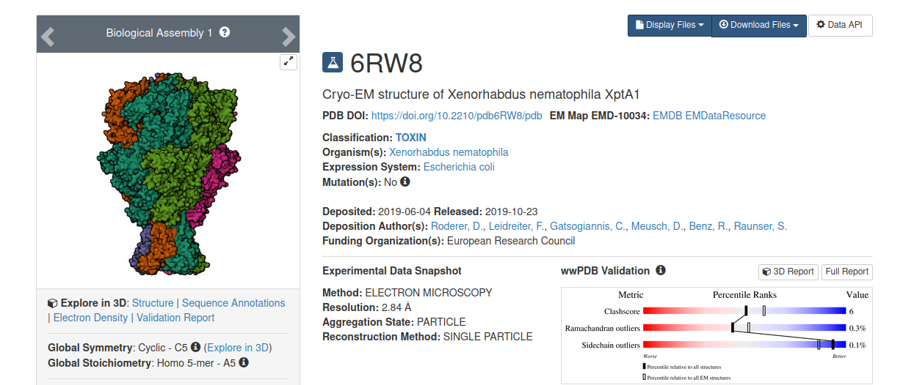

# Protein structure analysis workflow


## Installation

The following commands install dependencies of the workflow in the _current_
directory within the `.pixi` folder. After installation, you cannot move the
folder without re-installling all the dependencies.

```bash
curl -fsSL https://pixi.sh/install.sh | bash
# ... cd <this repo>
pixi install
```

Because of the dependency on apptainer, this workflow only works on linux.

## Usage

Run `pixi run help` for the help page. Targets can be made using `pixi run make <target>`

## Example

## Contact map and subunit graph.

In this example, we will make a contact map and subunit graph for `6RW8`:



In the terminal type

```bash
pixi run make results/contact-map/6rw8
```

