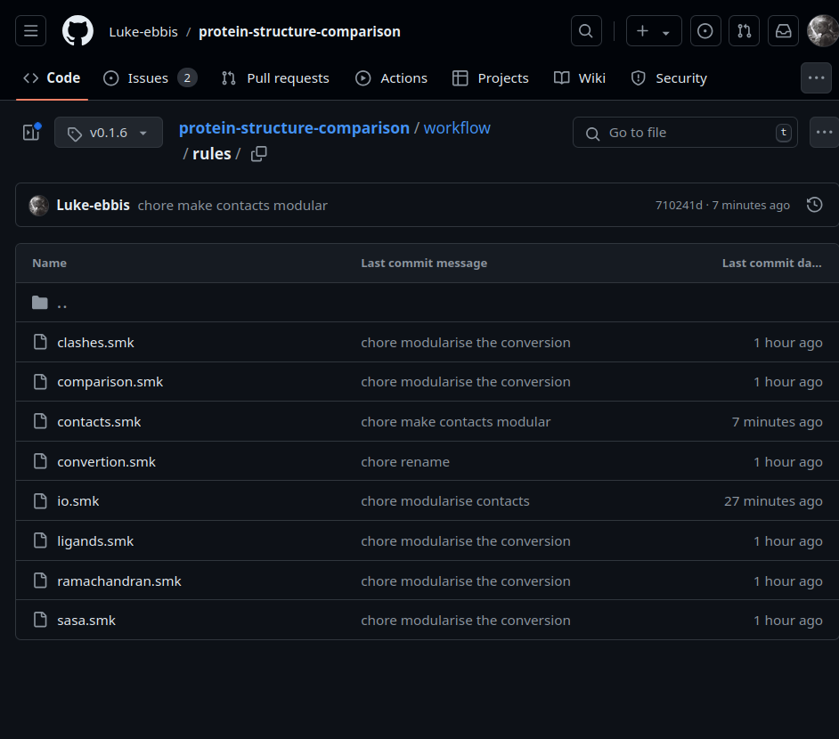

# Rules

In this directory, you will find rule files for each stage of the analysis of
this workflow. These files are modular and installable with conda.


## Importing a rule using git

If one wants to use a rule from git navigate to the rule you want to use, and copy the
git tag:



For this example, your snakefile would look like this:

```python

module analysis:
  snakefile: # indicate repository
        github("Luke-ebbis/protein-structure-comparison",
                # file
                path="workflow/rules/contacts.smk",
                # And version
                tag="v0.1.6")
  config: config

# import statement
use rule * analysis from *
```

With this snakefile, the command

```shell
snakemake -sdm conda results/contact-map/<target>
```

Will generate a contact map.

